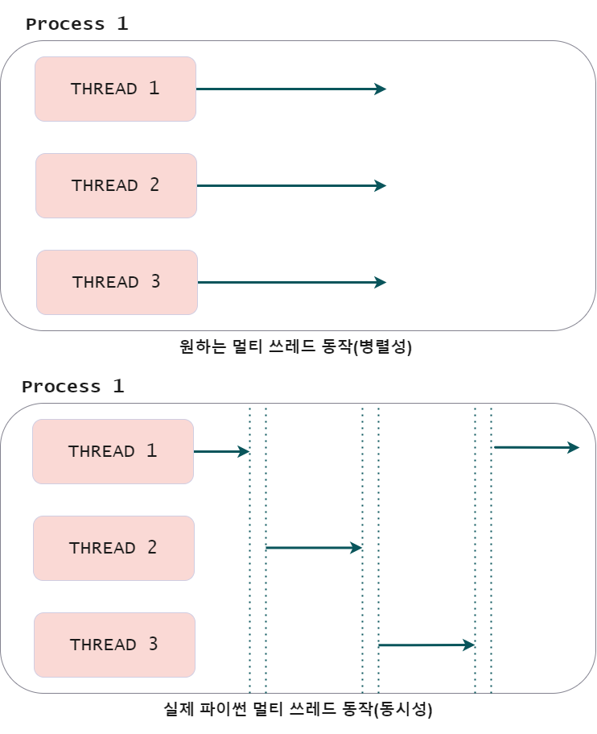

# GIL(Global Interpreter Lock)
>이번 글에 설명하는 내용은 다양한 파이썬 [구현체](https://github.com/vinta/awesome-python#implementations) 중 가장 오래되고 많이 사용하는 c 언어로 구현된 cpython을 바탕으로 한 내용입니다.

# 1. GIL 이란?
> Global Interpreter Lock  
> In CPython, the global interpreter lock, or GIL, is a **mutex** that protects access to Python objects, preventing multiple threads from **executing Python bytecodes** at once.

[파이썬 위키](https://wiki.python.org/moin/GlobalInterpreterLock) 에서는 GIL을 파이썬 객체에 대한 접근을 보호하는 mutex이며, 여러 스레드가 파이썬 바이트코드를 한번에 실행하는 것을 방지한다라고 설명한다.

공식문서를 보면 항상 느끼는 거지만 모르는 것을 찾으러 갔다가 더 모르는게 많아지는 상황이 발생한다. 천천히 내가 햇갈렸던 부분을 나눠서 이해하면서 GIL에 대해 알아보자.
 
`executing Python bytecodes`  
파이썬은 인터프리터를 통해 사용자가 작성한 파이썬 코드(소스 코드)를 한 줄 한 줄 컴파일하여 bytecode로 변환하고 이를 실행시킨다. 

`mutex`  
하나의 프로세스에 속한 여러 스레드는 공유되는 프로세스 자원에 접근할 수 있다. 이 때 이 접근 권한을 위한 키가 mutex 인 것이다. mutex를 가진 스레드만이 해당 자원에 접근할 수 있고 나머지 스레드는 대기한다.

즉 여러 스레드가 존재할 때 하나의 스레드만 인터프리터를 실행시킬 수 있도록 잠금을 걸어 여러 코어에서 병렬적인 실행을 막고 하나의 코어에서 동시성을 갖고 작동하게 하는게 GIL인 것이다.

여기까지 생각해보면 코어가 여러개인 좋은 머신에서 왜 한번에 하나의 코어만 사용 하느냐 라고 당연히 생각해볼 수 있다. 때문에 파이썬에는 왜 GIL이 존재하는지까지 알아봐야 한다.
  

  
# 2. GIL 존재 이유

> The GIL prevents **race conditions** and ensures **thread safety**. In short, this mutex is necessary mainly because **CPython's memory management** is **not thread-safe**.

[파이썬 위키](https://wiki.python.org/moin/GlobalInterpreterLock) 에서 GIL을 사용하는 이유는 race condition 발생을 방지하고 thread safety 를 보장하기 위함이라고 하며 파이썬이 메모리를 관리하는 방식이 thread safe 하지 않다고 말한다. 

`race conditions`
앞서 말한 것처럼 프로세스에 속한 여러 스레드는 공유되는 메모리의 객체에 접근할 수 있다고 했다. 이 때 여러 스레드가 동시에 동일한 객체에 접근하면 우리가 원치 않는 방향으로 객체가 읽히거나 변경 될 수 있는 상태를 말한다. 이런 상황을 우리는 `thread-safe` 하지 않다고 표현한다.

`CPython's memory management is not thread-safe`
파이썬은 메모리 관리 방식은 객체의 참조 횟수(reference count)를 통해 GC(Garbage Collection)가 동작하면서 이뤄진다. 객체가 레퍼런스의 참조에 따라 count를 늘리고 줄이면서 count 가 0 이 되면 메모리에서 삭제한다.   
이 때 여러 스레드가 인터프리터를 동시에 실행시키면 reference count 가 정상적으로 이뤄지지 않아 없어져야 할 객체가 남아있거나 그 반대가 될 수 있어 thread safe 않다.

즉 파이썬은 객체의 reference count의 정상 동작을 위해 mutex를 사용하는 것인데, 모든 것이 객체인 파이썬에서 객체 하나 하나에 mutex 를 사용하는 것은 큰 성능 저하를 가져오고 mutex 를 가져오고 풀어주는 과정에서 사용자가 실수할 가능성이 높기 때문에 인터프리터 자체를 잠궈서 객체 참조 횟수에 대한 race condition을 해결한 것이다. 
  
# 3. 다른 언어에서 thread safe 동작 방법
